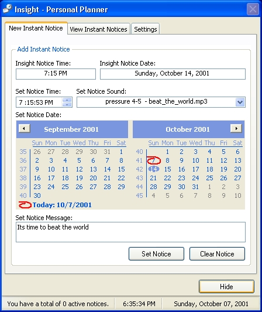



## Insight Personal Planner

### Description

Introducing Insight Personal Planner for Windows XP. With this program you can schedule unlimited alerts, set it to alarm clock mode, or even play your favorite mp3 as an alert. Version 2 will have, daily, weekly, monthly or yearly alerts. will also include an address book. This project currently uses my custom xpControls. but if you want real controls, check out my other submission "XP Manifest Maker" you can use this as a tutorial on how to create you own.
 
### More Info
 
Only WINXP Users can take advantage of theme drawing, all other os' will show the standard vb controls.

None Really

             |
---                |---
**Submitted On**   |2001-10-07 23:44:50
**By**             |[Hectotized](https://github.com/Planet-Source-Code/PSCIndex/blob/master/ByAuthor/hectotized.md)
**Level**          |Intermediate
**User Rating**    |4.9 (34 globes from 7 users)
**Compatibility**  |VB 6\.0
**Category**       |[Complete Applications](https://github.com/Planet-Source-Code/PSCIndex/blob/master/ByCategory/complete-applications__1-27.md)
**World**          |[Visual Basic](https://github.com/Planet-Source-Code/PSCIndex/blob/master/ByWorld/visual-basic.md)
**Archive File**   |[Insight Pe278661082001\.zip](https://github.com/Planet-Source-Code/hectotized-insight-personal-planner__1-27888/archive/master.zip)

